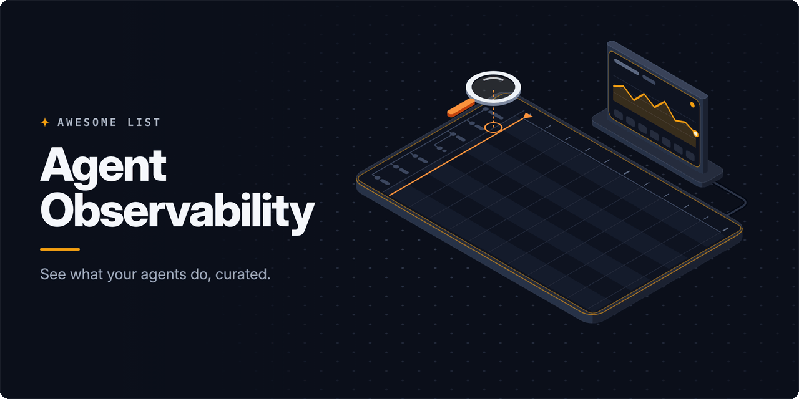

<!-- awesome:hero --><!-- /awesome:hero -->

<!-- awesome:title --><h1 align="center">Awesome Agent Observability</h1><!-- /awesome:title -->

<!-- awesome:tagline -->Tracing, monitoring, cost tracking and debugging for AI agents and LLM apps in production.<!-- /awesome:tagline -->

<!-- awesome:badges -->

  
  
  

<!-- /awesome:badges -->

An agent run is a chain of model calls, tool calls and handoffs, so finding out why it failed, slowed down or cost too much takes traces built for that shape. This list covers the platforms, vendors, instrumentation, framework tracing docs, gateways and cost tools for watching AI agents and LLM apps once they run in production.

## Contents

- [Open-source platforms](#open-source-platforms)
  - [Tracing and monitoring](#tracing-and-monitoring)
  - [Debuggers and trace viewers](#debuggers-and-trace-viewers)
- [Hosted platforms](#hosted-platforms)
- [Monitoring and cloud vendors](#monitoring-and-cloud-vendors)
- [Standards and instrumentation](#standards-and-instrumentation)
- [Framework tracing](#framework-tracing)
- [Gateways and proxies](#gateways-and-proxies)
- [Cost tracking](#cost-tracking)
- [Coding agent monitors](#coding-agent-monitors)
- [Guides](#guides)
- [Related lists](#related-lists)
- [Contributing](#contributing)

## Open-source platforms

### Tracing and monitoring

- [Agenta](https://github.com/Agenta-AI/agenta) - Self-hostable workspace that versions prompts and agents and traces their model and tool calls.
- [AgentOps](https://github.com/AgentOps-AI/agentops) - Python SDK that records agent sessions for replay, with cost and latency per run.
- [Arize Phoenix](https://github.com/Arize-ai/phoenix) - OpenTelemetry trace viewer with evals that runs in a notebook, a container or as a server.
- [Arthur Engine](https://github.com/arthur-ai/arthur-engine) - Collects OpenInference traces from agents and runs continuous evals and guardrails on them.
- [Coze Loop](https://github.com/coze-dev/coze-loop) - Open-source edition of Coze's agent platform for prompt work, evaluation and trace monitoring.
- [Evidently](https://github.com/evidentlyai/evidently) - Python library of metrics, tests and dashboards for monitoring ML and LLM systems over time.
- [Future AGI](https://github.com/future-agi/future-agi) - Self-hostable platform that traces, evaluates and simulates LLM and agent applications.
- [Helicone](https://github.com/Helicone/helicone) - Logs every LLM request with cost and latency once the app points its base URL at the proxy.
- [judgeval](https://github.com/JudgmentLabs/judgeval) - Judgment Labs SDK that traces agents on OpenTelemetry and scores production runs with judges.
- [Laminar](https://github.com/lmnr-ai/lmnr) - Tracing, session replay and evals for long-running agents, with a Rust backend.
- [Langfuse](https://github.com/langfuse/langfuse) - Self-hostable tracing, prompt management, datasets and evals that also ingests OpenTelemetry.
- [Langtrace](https://github.com/Scale3-Labs/langtrace) - OpenTelemetry-based tracing for LLM calls, vector stores and agent frameworks, with a web UI.
- [LangWatch](https://github.com/langwatch/langwatch) - Monitors agents on OpenTelemetry traces and pairs it with evals and simulated users.
- [Latitude](https://github.com/latitude-dev/latitude-llm) - Groups agent failures found in production traces and hands them to a coding agent to fix.
- [MLflow](https://github.com/mlflow/mlflow) - ML platform whose GenAI tracing records agent runs next to experiments and models.
- [OpenLIT](https://github.com/openlit/openlit) - OpenTelemetry SDK and self-hosted UI for LLM traces, token costs and GPU metrics.
- [OpenObserve](https://github.com/openobserve/openobserve) - OpenTelemetry backend for logs, metrics and traces with dashboards for LLM spans.
- [Opik](https://github.com/comet-ml/opik) - Comet's platform for tracing, scoring and monitoring LLM apps and agent workflows.
- [PandaProbe](https://github.com/chirpz-ai/pandaprobe) - Self-hostable platform with traces, evals and metrics for debugging agent runs.
- [Pezzo](https://github.com/pezzolabs/pezzo) - LLMOps platform that manages prompts and logs each request with its cost and latency.
- [Pydantic Logfire](https://github.com/pydantic/logfire) - OpenTelemetry SDK for Python and JavaScript that sends LLM and agent traces to Logfire.
- [RagaAI Catalyst](https://github.com/raga-ai-hub/RagaAI-Catalyst) - Python SDK that traces agent runs, tool calls and costs and evaluates them.
- [SigNoz](https://github.com/SigNoz/signoz) - OpenTelemetry-native traces, metrics and logs, with dashboards for LLM and agent spans.
- [Tracely](https://github.com/Jwuthri/Tracely-ai) - Grades agent traces as they arrive and turns failed runs into replayable regression tests.
- [TraceRoot](https://github.com/traceroot-ai/traceroot) - Traces agents and runs detectors over production traces to turn failures into evals.
- [W&B Weave](https://github.com/wandb/weave) - Weights & Biases toolkit that logs LLM calls as traces and compares app versions.

### Debuggers and trace viewers

- [Agent Prism](https://github.com/evilmartians/agent-prism) - React components that draw agent traces as span trees, timelines and detail panels.
- [AgentSight](https://github.com/eunomia-bpf/agentsight) - Uses eBPF to watch an agent's TLS traffic, processes and file access with no code changes.
- [Langfuse MCP](https://github.com/avivsinai/langfuse-mcp) - MCP server that lets an agent query Langfuse traces, errors and sessions.
- [OpenTelemetry MCP Server](https://github.com/traceloop/opentelemetry-mcp-server) - MCP server that queries LLM traces from Jaeger, Tempo and Traceloop for an agent.
- [Opik MCP](https://github.com/comet-ml/opik-mcp) - MCP server that gives coding agents read access to Opik traces, prompts and metrics.
- [OrcaReplay](https://github.com/Continuum-AI-Corp/OrcaReplay) - Records agent runs so they can be replayed, forked from any step and compared.
- [vLLora](https://github.com/vllora/vllora) - Local debugger that shows agent model and tool calls live as they happen.

## Hosted platforms

- [AgentCat](https://agentcat.com) - Usage analytics and tool-call traces for MCP servers, Claude connectors and ChatGPT apps.
- [Arize AX](https://arize.com/ax) - Arize's enterprise service for agent tracing, online evals and production monitors.
- [Braintrust](https://www.braintrust.dev) - Logs production traces and scores them with the same evals used before release.
- [Fiddler](https://www.fiddler.ai/agentic-observability) - Monitors agent sessions, tool calls and quality scores for enterprise deployments.
- [Galileo](https://galileo.ai) - Agent observability that scores each run with small judge models and flags failures.
- [HoneyHive](https://www.honeyhive.ai) - Traces, monitors and evaluates agents running in production.
- [LangSmith](https://www.langchain.com/langsmith) - LangChain's hosted tracing and monitoring for agents, built with LangChain or not.
- [Lunary](https://lunary.ai) - Logs LLM calls and conversations with cost, feedback and prompt versions.
- [Openlayer](https://www.openlayer.com) - Monitors and tests AI systems in production for teams in regulated industries.
- [Portkey](https://portkey.ai/features/observability) - Logs, traces and cost analytics for every request that goes through Portkey's gateway.
- [PromptLayer](https://www.promptlayer.com) - Prompt registry that logs each request and traces agent runs in production.
- [Raindrop](https://www.raindrop.ai) - Watches real user conversations for silent agent failures and alerts on them.
- [Respan](https://www.respan.ai) - Platform, formerly Keywords AI, that routes LLM calls and monitors and evaluates agent runs.
- [Traceloop](https://www.traceloop.com) - Hosted backend from the OpenLLMetry team that monitors LLM traces and quality.

## Monitoring and cloud vendors

- [Amazon Bedrock AgentCore Observability](https://docs.aws.amazon.com/bedrock-agentcore/latest/devguide/observability.html) - CloudWatch dashboards and OpenTelemetry traces for AgentCore agent sessions.
- [Amazon CloudWatch generative AI observability](https://docs.aws.amazon.com/AmazonCloudWatch/latest/monitoring/GenAI-observability.html) - CloudWatch views of model invocations, token use and agent traces.
- [Azure AI Foundry observability](https://learn.microsoft.com/en-us/azure/ai-foundry/concepts/observability) - Tracing, evaluation and monitoring for agents and models deployed on Foundry.
- [Coralogix AI Observability](https://www.coralogix.com/platform/ai-observability/) - Tracks LLM spans, cost and risky responses next to Coralogix logs and metrics.
- [Datadog LLM Observability](https://www.datadoghq.com/product/llm-observability/) - Traces LLM chains and agents in Datadog with token cost, latency and quality checks.
- [Dynatrace AI Observability](https://www.dynatrace.com/solutions/ai-observability/) - Monitors LLM and agent services with token use, cost and latency in Dynatrace.
- [Elastic LLM Observability](https://www.elastic.co/observability/llm-monitoring) - Collects LLM and agent traces, logs and cost into Elastic dashboards.
- [Google Cloud Observability for AI agents](https://docs.cloud.google.com/stackdriver/docs/instrumentation/ai-agent-overview) - How to send agent traces, logs and metrics to Cloud Trace and Cloud Logging.
- [Grafana Cloud AI Observability](https://grafana.com/docs/grafana-cloud/monitor-applications/ai-observability/) - Dashboards for LLM, vector database and agent telemetry sent over OpenTelemetry.
- [Honeycomb](https://www.honeycomb.io/use-cases/ai-llm-observability) - Queries LLM and agent spans as high-cardinality events to find what broke in production.
- [Middleware LLM Observability](https://middleware.io/product/llm-observability/) - Traces LLM calls and agent steps with cost and latency next to the rest of the stack.
- [New Relic AI Monitoring](https://newrelic.com/platform/ai-monitoring) - Traces AI responses, model calls and agent steps inside New Relic APM.
- [PostHog LLM Analytics](https://posthog.com/llm-analytics) - Captures generations, traces and cost as events next to product analytics.
- [Sentry AI Agent Monitoring](https://docs.sentry.io/product/insights/ai/agents/) - Shows agent runs, tool calls, token use and errors in Sentry traces.
- [Splunk AI Agent Monitoring](https://help.splunk.com/en/splunk-observability-cloud/observability-for-ai/splunk-ai-agent-monitoring) - Splunk Observability Cloud feature that tracks agent and LLM performance, cost and quality.

## Standards and instrumentation

- [LoongSuite Java](https://github.com/alibaba/loongsuite-java) - Alibaba library that emits OpenTelemetry GenAI telemetry from Java agent apps.
- [LoongSuite Python](https://github.com/alibaba/loongsuite-python) - Alibaba's Python agent that auto-instruments apps and LLM frameworks on OpenTelemetry.
- [Monocle](https://github.com/monocle2ai/monocle) - Linux Foundation tracer that maps agent, tool and model calls onto OpenTelemetry spans.
- [OpenInference](https://github.com/Arize-ai/openinference) - Span conventions and OpenTelemetry instrumentation for LLM SDKs and agent frameworks.
- [OpenLLMetry](https://github.com/traceloop/openllmetry) - Auto-instruments Python LLM and agent libraries with OpenTelemetry for any backend.
- [OpenLLMetry-Go](https://github.com/traceloop/go-openllmetry) - The Go version of OpenLLMetry.
- [OpenLLMetry-JS](https://github.com/traceloop/openllmetry-js) - The TypeScript and Node.js version of OpenLLMetry.
- [OpenTelemetry GenAI semantic conventions](https://github.com/open-telemetry/semantic-conventions-genai) - The standard names for model, tool and agent spans, metrics and events.
- [OpenTelemetry GenAI SIG](https://github.com/open-telemetry/community/blob/main/projects/gen-ai.md) - Charter of the OpenTelemetry group that defines GenAI telemetry.
- [OpenTelemetry Python GenAI](https://github.com/open-telemetry/opentelemetry-python-genai) - Official OpenTelemetry instrumentation for OpenAI, Anthropic, Google GenAI and more.
- [Traccia](https://github.com/traccia-ai/traccia-py) - OpenTelemetry-native Python SDK that traces agent runs and applies policy to them.

## Framework tracing

- [AutoGen tracing](https://microsoft.github.io/autogen/stable/user-guide/agentchat-user-guide/tracing.html) - How AutoGen agents emit OpenTelemetry traces of messages and tool calls.
- [Claude Agent SDK observability](https://code.claude.com/docs/en/agent-sdk/observability) - Exports Agent SDK traces, metrics and events over OpenTelemetry.
- [Claude Code monitoring](https://code.claude.com/docs/en/monitoring-usage) - Sends Claude Code usage, cost and tool events to an OpenTelemetry collector.
- [Codex observability](https://learn.chatgpt.com/docs/config-file/config-advanced#observability-and-telemetry) - Codex settings that export OpenTelemetry logs and metrics for each session.
- [CrewAI observability](https://docs.crewai.com/en/observability/overview) - Guides for sending CrewAI agent and task traces to tracing platforms.
- [Google ADK observability](https://google.github.io/adk-docs/observability/) - Logging, tracing and integrations for agents built with the Agent Development Kit.
- [Haystack tracing](https://docs.haystack.deepset.ai/docs/tracing) - Traces Haystack pipelines and agents with OpenTelemetry, Datadog or Langfuse.
- [LangChain observability](https://docs.langchain.com/oss/python/langchain/observability) - Tracing LangChain and LangGraph agents with LangSmith.
- [LlamaIndex observability](https://developers.llamaindex.ai/python/framework/module_guides/observability/) - Instrumentation module and one-line integrations for tracing LlamaIndex apps.
- [Mastra observability](https://mastra.ai/docs/observability/overview) - Built-in tracing and logging for Mastra agents and workflows.
- [Microsoft Agent Framework observability](https://learn.microsoft.com/en-us/agent-framework/user-guide/observability) - OpenTelemetry traces, logs and metrics from Agent Framework agents.
- [OpenAI Agents SDK tracing](https://openai.github.io/openai-agents-python/tracing/) - Built-in traces of agent runs, tool calls and handoffs, with custom exporters.
- [Pydantic AI with Logfire](https://ai.pydantic.dev/logfire/) - Instruments Pydantic AI agents with OpenTelemetry for Logfire or any backend.
- [Semantic Kernel observability](https://learn.microsoft.com/en-us/semantic-kernel/concepts/enterprise-readiness/observability/) - Logs, metrics and OpenTelemetry traces from Semantic Kernel apps.
- [Spring AI observability](https://docs.spring.io/spring-ai/reference/observability/index.html) - Micrometer metrics and traces for chat, embedding and tool calls in Spring AI.
- [Strands Agents traces](https://strandsagents.com/docs/user-guide/sdk/observability-evaluation/traces/) - OpenTelemetry traces of each Strands agent cycle, model call and tool call.
- [Vercel AI SDK telemetry](https://ai-sdk.dev/docs/ai-sdk-core/telemetry) - Opt-in OpenTelemetry spans for AI SDK generate and stream calls.

## Gateways and proxies

- [Agent Router](https://github.com/theagentrouter/agent-router) - Envoy-based gateway, formerly Envoy AI Gateway, that meters tokens and emits GenAI traces.
- [agentgateway](https://github.com/agentgateway/agentgateway) - Proxy for LLM, MCP and agent-to-agent traffic with OpenTelemetry tracing built in.
- [AxonHub](https://github.com/looplj/axonhub) - Self-hosted AI gateway with request tracing, usage logs and cost limits.
- [Bifrost](https://github.com/maximhq/bifrost) - Go gateway for many LLM providers that exports Prometheus metrics and OpenTelemetry traces.
- [Cloudflare AI Gateway](https://developers.cloudflare.com/ai-gateway/) - Cloudflare proxy that logs AI requests with tokens, cost and errors.
- [Helicone AI Gateway](https://github.com/Helicone/ai-gateway) - Rust gateway that routes LLM requests and reports them to Helicone.
- [Kong AI Gateway](https://developer.konghq.com/ai-gateway/) - Kong plugins that add LLM routing, token metrics and request logs.
- [LiteLLM](https://github.com/BerriAI/litellm) - Proxy and SDK for many LLM APIs with spend tracking and callbacks to tracing tools.
- [Plano](https://github.com/katanemo/plano) - AI-native proxy for agent apps with routing and OpenTelemetry tracing of each request.
- [Portkey AI Gateway](https://github.com/Portkey-AI/gateway) - Open-source gateway that routes to many models and logs each request.
- [Traceloop Hub](https://github.com/traceloop/hub) - Rust LLM gateway from the OpenLLMetry team that emits OpenTelemetry traces.
- [Vercel AI Gateway observability](https://vercel.com/docs/ai-gateway/observability-and-spend/observability) - Request logs, token counts and spend for models called through Vercel.

## Cost tracking

- [genai-prices](https://github.com/pydantic/genai-prices) - Price data and calculators for LLM API calls in Python and JavaScript.
- [LLM Prices](https://github.com/simonw/llm-prices) - Simon Willison's table and calculator of model prices per million tokens.
- [Portkey Models](https://github.com/Portkey-AI/models) - Open pricing and configuration data for LLMs, used to attribute request cost.
- [TokenLens](https://github.com/xn1cklas/tokenlens) - TypeScript helpers for context limits and cost estimates from model metadata.
- [tokentap](https://github.com/jmuncor/tokentap) - Intercepts LLM API traffic and shows tokens and cost in a terminal dashboard.

## Coding agent monitors

- [abtop](https://github.com/graykode/abtop) - Terminal view, like htop, of Claude Code and Codex sessions, tokens and context.
- [Agent Console](https://github.com/LockedinLabs-AI/agent-console) - Local console of Claude Code and Codex sessions with tokens, cache use and cost.
- [agentacct](https://github.com/mikehasa/agentacct) - Breaks coding agent tasks into steps with the tools, files and cost of each.
- [agents-observe](https://github.com/simple10/agents-observe) - Live view of Claude Code sessions and the subagents they start.
- [AgentsView](https://github.com/kenn-io/agentsview) - Local search, analytics and token stats across coding agent session archives.
- [ccusage](https://github.com/ccusage/ccusage) - CLI that reports Claude Code and Codex token use and cost from local logs.
- [Claude Code Agent Monitor](https://github.com/hoangsonww/Claude-Code-Agent-Monitor) - Live dashboard of Claude Code and Codex sessions, agents and tool calls.
- [Claude Code Hooks Multi-Agent Observability](https://github.com/disler/claude-code-hooks-multi-agent-observability) - Streams hook events from many Claude Code agents into one live dashboard.
- [Claude Code Usage Monitor](https://github.com/Maciek-roboblog/Claude-Code-Usage-Monitor) - Terminal monitor of Claude Code token use that predicts when a limit will hit.
- [claude-devtools](https://github.com/matt1398/claude-devtools) - Desktop app for reading Claude Code session logs, tool calls, tokens and subagents.
- [claude-tap](https://github.com/liaohch3/claude-tap) - Captures the API traffic of Claude Code, Codex and other coding CLIs for inspection.
- [ClawMetry](https://github.com/vivekchand/clawmetry) - Reads the session files of many agent runtimes into one timeline of tool calls and cost.
- [CodeBurn](https://github.com/getagentseal/codeburn) - Local tracker of token use and cost across many AI coding tools and agents.
- [Failproof AI](https://github.com/FailproofAI/failproofai) - Hooks into agent harnesses to record every run and block dangerous tool calls.
- [LoongSuite Pilot](https://github.com/alibaba/loongsuite-pilot) - Collects OpenTelemetry events from Claude Code, Codex and other coding agents.
- [OpenClaw Monitor](https://github.com/flik2002/openclaw-monitor) - Self-hosted web dashboard for OpenClaw agents: token usage, sessions and weekly trends.
- [Splitrail](https://github.com/Piebald-AI/splitrail) - Real-time token and cost tracker for Claude Code, Codex CLI and other agents.
- [Token Meter](https://github.com/splunk/token-meter) - Splunk's local dashboard of usage and cost across coding agents.

## Guides

- [A complete guide to LLM observability with OpenTelemetry](https://grafana.com/blog/a-complete-guide-to-llm-observability-with-opentelemetry-and-grafana-cloud/) - Grafana Labs walkthrough of instrumenting an LLM app and reading its traces.
- [A field guide to rapidly improving AI products](https://hamel.dev/blog/posts/field-guide/) - Hamel Husain on reading real traces to find the failures worth fixing.
- [Agent observability](https://arize.com/ai-agents/agent-observability/) - Arize's guide to tracing, debugging and evaluating agents step by step.
- [AI agent observability](https://opentelemetry.io/blog/2025/ai-agent-observability/) - OpenTelemetry post on where the GenAI conventions stand for agents and frameworks.
- [How to debug AI agents](https://www.langchain.com/blog/agent-observability-powers-agent-evaluation) - LangChain on why agent traces are the base for debugging and evaluation.
- [How we built our multi-agent research system](https://www.anthropic.com/engineering/multi-agent-research-system) - Anthropic on running a multi-agent system, including its production tracing.
- [Introduction to observability for LLM-based applications](https://opentelemetry.io/blog/2024/llm-observability/) - OpenTelemetry walkthrough of tracing an LLM app with open-source tools.
- [OpenTelemetry for generative AI](https://opentelemetry.io/blog/2024/otel-generative-ai/) - Introduces the GenAI conventions and the first OpenAI instrumentation.

## Related lists

- [Awesome Agent Observability (anhermon)](https://github.com/anhermon/awesome-agent-observability) - Hands-on checked list of tracing standards, platforms and eval tools.
- [Awesome AI Tokenomics](https://github.com/QuesmaOrg/awesome-ai-tokenomics) - What tokens cost, where they get wasted and the tools that cut the bill.
- [Awesome LLM Observability](https://github.com/ContextJet-ai/awesome-llm-observability) - LLM observability tools plus agent skills for working with them.
- [Awesome LLMOps](https://github.com/tensorchord/Awesome-LLMOps) - Broad list of tools for building, serving and running LLM apps.

## Contributing

Contributions are welcome. Read the [contribution guidelines](contributing.md) first.

<!-- awesome:maintainer -->
Maintained by [Ian Wiedenman](https://github.com/ianwieds).
<!-- /awesome:maintainer -->
